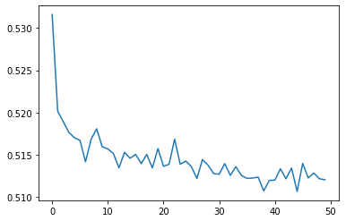

# riiid-aied-challenge

[](https://jupyter.org/try)


## Description
`riiid-aied-challenge` explores classification methods to predict whether a student will answer a test question correctly. `riiid-aied-challenge` attemps to solve the [Riiid AIEd Challenge](https://www.ednetchallenge.ai/) that was presented as the Kaggle competition: [Riiid! Answer Correctness Prediction](https://www.kaggle.com/c/riiid-test-answer-prediction).

## Usage

### Environment

Navigate to the `riiid-aied-challenge` directory and setup a new `conda` environment using the following commands.

```
conda create -n riiid python=3.8.5 -y
conda activate riiid
conda install ipykernel -y
ipython kernel install --user --name=riiid
```

### Dependencies

Install the dependencies using the following command.

`pip install -r requirements.txt`

### Execution

To train and test the classifiers, run the cells of the Jupyter notebooks, using `jupyter lab`, ensuring the `riiid` kernel is selected.

Training data should be placed at `data/train.csv`. The training data CSV used by `riiid-aied-challenge` can be found [here](https://www.kaggle.com/c/riiid-test-answer-prediction/data?select=train.csv).

### Results

The following are loss vs. epoch plots for the classifier's training stages:

Binary Classifier (3 Layers with Batch Normalization)

<p float="left" align="center">
  
</p>

Binary Classifier (4 Layers with Batch Normalization)


<p float="left" align="center">
  
</p>

Binary Classifier (3 Layers without Batch Normalization)


<p float="left" align="center">
  
</p>

LSTM Binary Classifier (3 LSTM layers, 2 FC layers)


<p float="left" align="center">
  
</p>

## Authors

* Rishi Masand
* Arjun Arun

## Resources

[PyTorch [Tabular] — Binary Classification](https://towardsdatascience.com/pytorch-tabular-binary-classification-a0368da5bb89) by Akshaj Verma

[CNN-LSTM PyTorch RIIID](https://www.kaggle.com/shivanandmn/cnn-lstm-pytorch-riiid) by Shivanand M N